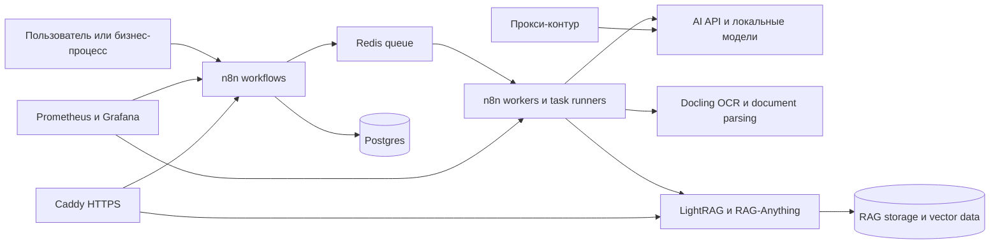
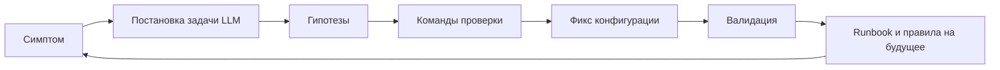

# Как я развернул self-hosted AI platform с ChatGPT и AI-агентами, не будучи DevOps-инженером

## Коротко

Кейс про то как предприниматель с базовым техническим кругозором, но без практического опыта DevOps, смог с помощью ChatGPT и правильно поставленных задач для AI-агентов развернуть, адаптировать и довести до рабочего состояния собственный AI automation stack.

Раньше такая задача почти всегда означала отдельного DevOps-специалиста, долгую коммуникацию, сметы, ожидание в очереди и риск получить систему, которую бизнес не понимает и не может развивать без подрядчика.

В моем случае результатом стал рабочий personal stack на базе `n8n-installer`: n8n для автоматизаций, Caddy для HTTPS-доступа, Docker Compose profiles для управления сервисами, Postgres и Redis как базовая инфраструктура, worker queue для выполнения workflow, набор AI/RAG/OCR-сервисов, мониторинг и отдельный прокси-контур для доступа к AI API.

Это не enterprise-платформа, а практичный self-hosted контур, который позволяет дешевле и быстрее проверять AI-гипотезы, запускать внутренние автоматизации, работать с документами, строить RAG-сценарии и меньше зависеть от внешних SaaS и подрядчиков на каждом шаге.

## Почему это важно для бизнеса

Бизнесу нужен не web-доступ к модели, а встроить AI в реальный операционный процесс.

Нужны очереди задач, хранение данных, доступы, OCR, обработка документов, RAG, прокси, мониторинг, понятные runbook-и, изоляция кастомизаций, проверка того, что сервисы живы. В обычной компании это быстро превращается в набор зависимостей между бизнесом, разработкой, DevOps, безопасностью и подрядчиками.

Мой интерес был практическим: собрать среду, где можно быстро проверять AI-продуктовые идеи и внутренние автоматизации. Например: обработка входящих документов, извлечение данных из PDF, построение базы знаний, запуск n8n workflow с AI Agent, подключение внешних LLM API и локальных моделей, тестирование RAG-пайплайнов, наблюдение за состоянием сервисов.

Я делал проект в роли AI-оператора: человек, который умеет превратить неопределенную задачу в последовательность проверяемых действий и использовать LLM как усилитель мышления, диагностики и документации.

Главный навык - уметь поставить AI правильную задачу, получить несколько гипотез, проверить каждую гипотезу в системе, найти корневую причину и оставить после себя артефакт - документ с воспроизводимым порядком действий.

## Что было построено

Базой стал `n8n-installer` от Yuri Kossakovsky (https://github.com/kossakovsky/n8n-installer): Docker Compose-проект для self-hosted AI automation platform. Он дает готовый фундамент: установочный сценарий, Caddy reverse proxy, автоматический HTTPS, Postgres, Redis, n8n, worker queue, набор опциональных AI-сервисов и мониторинг.

Поверх этого я адаптировал стек под свои дополнительные задачи:

- Docker Compose profiles позволяют включать нужные сервисы без ручной сборки отдельной инфраструктуры каждый раз.
- LightRAG используется как графовый RAG-контур для работы с документами и знаниями.
- Docling помогает превращать PDF, офисные документы и изображения в пригодный для обработки текст и JSON/Markdown.
- RAG-Anything добавлен как внутренний ingestion runner: он не является публичным сервисом, а загружает документы в хранилище LightRAG.
- Мониторинг через Prometheus и Grafana дает базовую видимость состояния.
- Прокси-контур позволяет сервисам обращаться к внешним AI API и репозиториям моделей через контролируемый маршрут.

Упрощенно архитектура выглядит так:

У меня появился контур, где AI можно включать в повторяемые процессы. Построить workflow, который принимает входные данные, вызывает нужные модели, сохраняет результат, работает с документами и может быть проверен.

## Как я работал с AI

Мой рабочий цикл был простым и повторяемым:

Я давал факты: статус контейнера, фрагмент лога, compose-секцию, список активных контейнеров, результат проверки внутри контейнера. Затем просил:

- определить симптомы и возможные причины;
- предложить минимальные проверки;
- объяснить, какой результат подтвердит или опровергнет гипотезу;
- после фикса оформить runbook для повторения.

AI помогал быстрее читать незнакомые ошибки, сравнивать варианты, помнить о типовых ловушках Docker Compose, формулировать команды проверки и документировать итог. Но решение принимал я: что проверять, какой риск допустим, когда остановиться, что считать доказательством.

## Эпизод 1. n8n queue: ошибка AI Agent оказалась не там, где казалась

В n8n периодически падал production webhook workflow с AI Agent. Ошибка выглядела как проблема внутри AI Agent node: `Cannot read properties of undefined (reading 'execute')`. В логах мелькали следы LangChain и n8n internals. На поверхности это выглядело как баг конкретного узла, несовместимость версии или неправильная настройка tracing.

AI помог не застрять на первом объяснении. Я разложил проблему как операционный инцидент: что падает, когда падает, какие контейнеры выполняют задания, кто читает Redis queue, есть ли несколько execution path.

Корневая причина оказалась инфраструктурной: одновременно работали актуальные workers и legacy orphan workers из старой схемы именования. Оба набора читали одну и ту же Redis queue. Из-за этого часть задач выполнялась не тем путем, который ожидался текущей конфигурацией, и поведение становилось нестабильным.

Важный момент: рядом был шум, который легко принять за причину. Например, предупреждения и ошибки авторизации вокруг tracing выглядели заметно, но не объясняли сам сбой `undefined.execute`. Через проверки удалось отделить шум от причины.

Фикс был в том, чтобы убрать legacy orphan workers, пересоздать актуальный n8n stack и закрепить prevention checklist: после обновлений проверять, что старые worker-контейнеры не вернулись.

## Эпизод 2. LightRAG: контейнер работал, но считался unhealthy

LightRAG поднимался и отвечал на запросы, но Docker показывал контейнер как unhealthy. Для бизнеса это опасный тип проблемы: сервис вроде бы работает, но мониторинг и зависимости видят его как неисправный. Потом такие вещи превращаются в ложные тревоги, неправильные рестарты или недоверие к инфраструктуре.

Первое подозрение могло быть на сам LightRAG. Но проверка показала другое: healthcheck в compose использовал `wget`, а в конкретном образе не было ни `wget`, ни `curl`. При этом Python в контейнере был доступен. Значит, проблема была не в приложении, а в способе проверки здоровья.

Фикс: заменить healthcheck на Python-проверку HTTP endpoint-а.

После правки контейнер перешел в healthy, счетчик неудачных проверок сбросился, предупреждение исчезло. AI помог быстро сузить область проверки.

## Эпизод 3. Docling OCR/GPU: русские документы и модели EasyOCR

Следующая задача была в обработке документов, в том числе русскоязычных. Docling умеет конвертировать PDF и изображения, а EasyOCR может распознавать русский текст. Но при включении русского языка OCR в UI возвращал общую ошибку “Task failed”.

Полезная причина была в логах контейнера: Docling не находил модель EasyOCR для кириллицы в ожидаемом artifacts path. Ситуация была тоньше, чем “скачай модель”. CUDA-capable образ был запущен, но настройки указывали на CPU. После включения CUDA стало ясно, что EasyOCR может скачать модели в свой cache, но Docling Serve в рабочем процессе смотрит в отдельную директорию artifacts и ожидает модели там.

Решение состояло из нескольких частей:

- явно настроить выполнение на `cuda:0`, чтобы контейнер использовал GPU;
- сделать cache и директорию моделей persistent volumes, чтобы модели не терялись после пересоздания контейнера;
- проверить доступность CUDA внутри контейнера, а не верить compose-файлу на слово;
- убедиться, что EasyOCR-модели для русского и английского лежат там, где Docling Serve их ищет;
- оставить проверочный сценарий, который отдельно тестирует GPU, EasyOCR и локальные artifacts без скачивания.

## Эпизод 4. RAG-Anything и LightRAG: ingestion без лишнего публичного сервиса

RAG-Anything - это внутренний ingestion runner для LightRAG без внешнего URL. Его задача - взять документ из staging-директории, распарсить его, положить результат в общее LightRAG-хранилище, после чего вопросы задаются через уже существующий LightRAG UI или API.

Здесь важна не только техническая связка, но и storage semantics. Нужно было понять, где временные файлы, где debug artifacts, где настоящий источник правды, что можно чистить после успешной загрузки, а что нельзя удалять без отдельной процедуры в LightRAG.

В результате появился рабочий операторский процесс:

- документ кладется во временную input-директорию;
- ingestion запускается одноразовой командой;
- для первичной проверки можно использовать CPU path, для нормальной работы на валидированном хосте - GPU path;
- после успешной загрузки LightRAG перезапускается, чтобы увидеть новые данные;
- результат проверяется через список документов и retrieval-запрос;
- временные input/output artifacts очищаются отдельно и не считаются источником истины.

Этот эпизод особенно хорошо показывает, почему AI-оператор - не “человек, который спрашивает у ChatGPT”. Я использовал AI, чтобы разобраться в связке нескольких инструментов, но управленческая задача была шире: определить границы сервиса, не открывать лишние endpoints, зафиксировать поток загрузки документов и разделить runtime-мусор от долговременного знания.

## Эпизод 5. Прокси-контур: кастомизации отдельно от базового проекта

Отдельной задачей был доступ контейнеров к внешним AI API и загрузке моделей. В такой системе недостаточно добавить один proxy URL. Разные сервисы обращаются к разным хостам: LLM API, embeddings API, Hugging Face, CDN для больших файлов, Xet storage для моделей. Если один из этих хостов не проходит, проблема проявляется как “модель не скачалась”, “OCR не стартует” или “workflow завис”.

Ключевым решением стало разделение базового проекта и локальных кастомизаций. Вместо того чтобы править основной `docker-compose.yml` под конкретную среду, настройки маршрутизации вынесены в `docker-compose.override.yml`: `extra_hosts`, параметры для отдельных сервисов, GPU-настройки, переменные окружения, отдельные volumes.

На стороне прокси используется stream/SNI-подход: TLS-соединение маршрутизируется по имени нужного upstream-хоста без раскрытия прикладного трафика на уровне контейнеров проекта. В статье я намеренно не раскрываю реальные IP, домены и operational details, потому что публичный кейс должен показывать подход, а не отдавать карту инфраструктуры.

Бизнес-ценность здесь в сопровождаемости. Когда базовый open-source проект обновляется, локальные изменения не растворяются в ручных правках. Их можно отдельно проверить, отключить, перенести, объяснить другому специалисту или автоматизировать. Это снижает зависимость от “того самого человека, который когда-то настроил сервер”.

## Что в этом кейсе делал AI, а что делал я

Важно честно разделить роли.

AI помогал:

- быстро читать незнакомые логи и документацию;
- предлагать гипотезы и проверки;
- замечать несовпадения между compose-файлом, контейнером и фактическим runtime;
- формулировать команды диагностики;
- объяснять trade-off между быстрым workaround и устойчивым фикс-путем;
- превращать успешные действия в runbook.

Я делал другое:

- выбирал цель и критерии результата;
- решал, какие гипотезы проверять первыми;
- не принимал объяснение без подтверждения командой или логом;
- ограничивал область изменений;
- следил, чтобы публичный стек не раскрывал лишнее;
- переводил технический результат в операционный процесс.

В этом и есть мой главный профессиональный тезис: я умею управлять AI-агентами так, чтобы они усиливали одного человека до уровня небольшой кросс-функциональной команды. Не магией, а дисциплиной: постановка задачи, проверка, фиксация, повторяемость.

## Бизнес-результат

На выходе появился рабочий personal stack для AI automation. Он не претендует на статус enterprise-grade платформы с SLA и полной отказоустойчивостью. Зато он уже решает главную задачу: дает мне среду, где можно быстро переходить от идеи к прототипу и от прототипа к повторяемому внутреннему процессу.

Что это дает бизнесу:

- быстрее проверять AI-гипотезы без закупки отдельного SaaS на каждую идею;
- запускать n8n-автоматизации с AI Agent и очередью задач;
- обрабатывать документы через OCR и document parsing;
- строить RAG-сценарии поверх собственных данных;
- подключать внешние AI API и локальные модели в одном контуре;
- видеть состояние сервисов через мониторинг;
- сохранять знания в runbook-ах, а не только в истории чата.

Самое важное: такой подход снижает стоимость неопределенности. В AI-проектах часто непонятно, что сработает: какая модель, какой пайплайн, какой формат документа, какой RAG-подход, какой workflow. Когда есть собственный контур и оператор, который умеет быстро проводить проверяемые итерации, бизнес может принимать решения раньше и с меньшей зависимостью от внешней разработки.

## Почему это портфельный кейс, а не технический туториал

Я мог бы превратить эту историю в набор команд Docker. Но для портфолио важнее другое: показать, что я умею брать сложную, расплывчатую AI/automation-задачу и доводить ее до рабочего состояния.

В этом проекте были все типичные элементы реальной работы:

- неполная документация;
- разные сервисы с разными ожиданиями к runtime;
- контейнеры, которые работают, но неверно проходят healthcheck;
- ошибки, где видимый симптом не совпадает с причиной;
- GPU/CPU-различия;
- загрузка моделей и persistent storage;
- прокси и сетевые ограничения;
- необходимость не сломать базовый проект локальными правками;
- потребность оставить после себя понятные инструкции.

Для бизнеса это и есть ценность. Не “я знаю названия инструментов”, а “я могу собрать из них операционный контур и удерживать причинно-следственную цепочку, пока система не начнет работать”.

## Куда я хочу применять этот навык

Мне интересны задачи на пересечении AI, операций и продукта:

- внутренние AI-инструменты для команд;
- n8n-автоматизации с LLM, RAG и OCR;
- обработка документов и извлечение структурированных данных;
- AI-ассистенты поверх корпоративных знаний;
- интеграции между SaaS, API, базами данных и workflow-системами;
- прототипирование self-hosted AI-инфраструктуры для проверки гипотез;
- аудит AI-процессов, где “что-то работает, но никто не понимает почему”.

Мой сильный навык - не в том, что я заменяю инженеров магией. Я умею управлять AI и AI-агентами так, чтобы один человек мог закрыть большой кусок работы, для которого раньше требовалась команда: разобраться, сформулировать план, проверить гипотезы, внедрить изменения, задокументировать результат и объяснить бизнесу, что именно теперь стало возможным.

Если у вас есть сложная AI/automation-задача, где много неопределенности, разрозненных инструментов и нет понятного пути от идеи к рабочему процессу, это как раз тот тип задач, который мне интересен. Я умею брать такой хаос и превращать его в управляемую систему.
